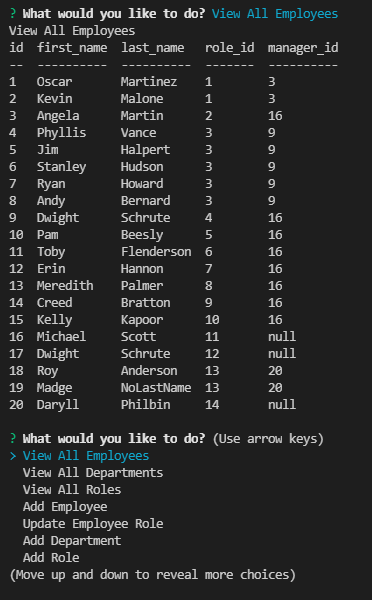

# Unit-twelve-homework

## Description
Application for managing company's employees using node, inquirer, and MySQL. Database schema contains 3 tables (department, role, and employee tables). Command-line application allows a user to add and view departments, roles, and employees, as well as update employee roles. 

## Table of Contents 
 - [Installation](#installation)
 - [Usage](#usage)
 - [Credits](#credits)
 - [Contribution Guidelines](#contribution-guidelines)
 - [Test Instructions](#test-instructions)
 - [License](#license)

## Installation
Use package.json to download dependencies (using npm install).

## Usage
* Install packages. 
* Copy and paste employeeDB.sql and seed.sql in MySQL Workbench to create database and tables. 
* Open integrated terminal in Visual Studio Code and start application (node index.js).
* Answer prompts.
* Select 'Quit' when done using application.

## Credits
Libraries:
* MySQL to connect to MySQL database and perform queries
* Inquirer to obtain user input via the command-line
* console.table to print MySQL rows to console

## Contribution Guidelines
Utilize <a href= "https://www.contributor-covenant.org/version/2/0/code_of_conduct/code_of_conduct.md">The Contributor Covenant</a> as reference for appropriate contribution guidelines.

## Test Instructions
n/a

## License
License type: MIT

    "Copyright 2021 <COPYRIGHT HOLDER>

    Permission is hereby granted, free of charge, to any person obtaining a copy of this software and associated documentation files (the "Software"), to deal in the Software without restriction, including without limitation the rights to use, copy, modify, merge, publish, distribute, sublicense, and/or sell copies of the Software, and to permit persons to whom the Software is furnished to do so, subject to the following conditions:
    
    The above copyright notice and this permission notice shall be included in all copies or substantial portions of the Software.
    
    THE SOFTWARE IS PROVIDED "AS IS", WITHOUT WARRANTY OF ANY KIND, EXPRESS OR IMPLIED, INCLUDING BUT NOT LIMITED TO THE WARRANTIES OF MERCHANTABILITY, FITNESS FOR A PARTICULAR PURPOSE AND NONINFRINGEMENT. IN NO EVENT SHALL THE AUTHORS OR COPYRIGHT HOLDERS BE LIABLE FOR ANY CLAIM, DAMAGES OR OTHER LIABILITY, WHETHER IN AN ACTION OF CONTRACT, TORT OR OTHERWISE, ARISING FROM, OUT OF OR IN CONNECTION WITH THE SOFTWARE OR THE USE OR OTHER DEALINGS IN THE SOFTWARE."

Source for licensing information: <a href="https://opensource.org/licenses/MIT">Link to MIT license information</a>

## Screenshots

Screenshot of terminal while using application to view table and select next task:

## URLs
<a href="https://github.com/mlward639/Unit-twelve-homework">Link to GitHub Repository</a>

<a href="https://drive.google.com/file/d/1f3TXoEbRmM7aIv0J2VRvtau6vkrcvXvt/view">Link to Deployed Heroku Application</a>
